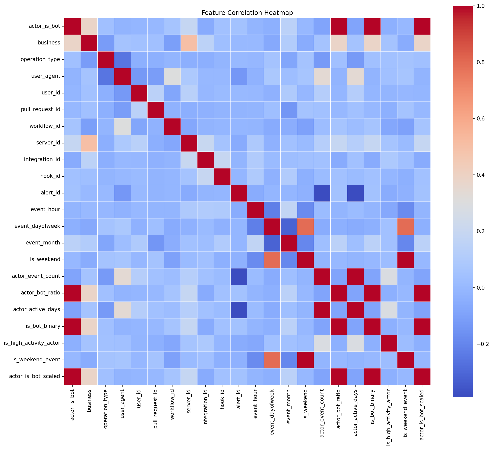
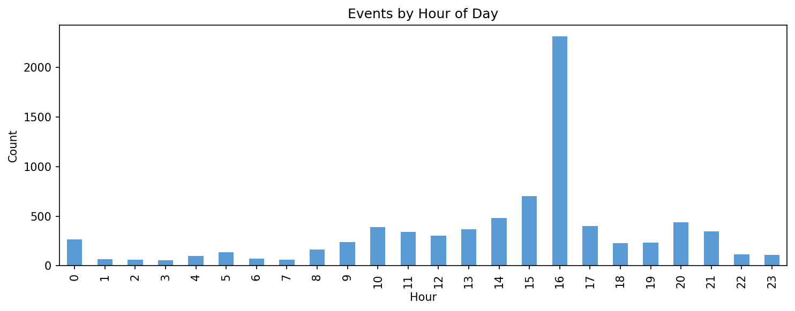
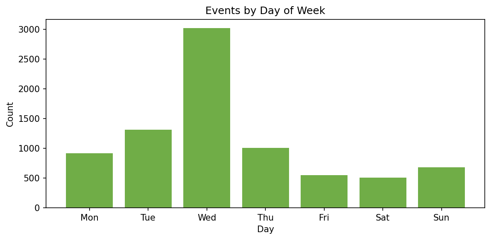
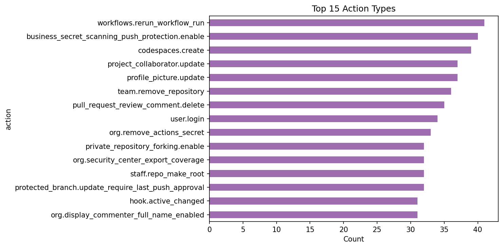
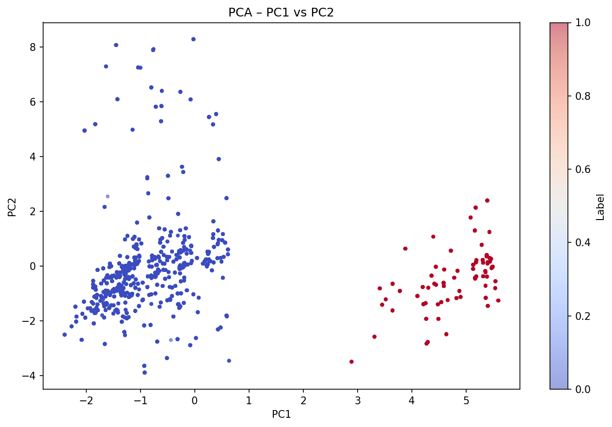
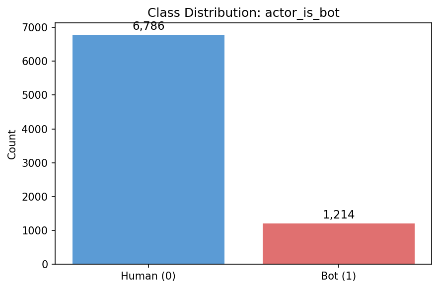
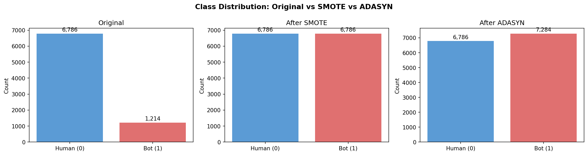

# Machine Learning 

> **Course:** Machine Learning  
> **Professor:** Prof. Dr. Lule AHMEDI  
> **Assistant:** Dr. Sc. Mërgim H. HOTI  
> **University:** University of Prishtina "Hasan Prishtina"  
> **Faculty:** Faculty of Electrical and Computer Engineering (FIEK)  
> **Study Level:** Master — Semester II | Academic Year: 2025/26

---

##  Contributors

| Name 
|------|
| `Dredhza Braina` |
| `Suhejla Hoxha` | 
| `Ylljete Kicaj` | 

---

## Project Overview

This project builds a complete **Phase I Data Preparation pipeline** for a GitHub activity-log dataset. The goal is to clean, transform, and prepare the data for training a binary classifier that predicts whether an actor is a **bot or a human** (`actor_is_bot`).

The entire pipeline is written in modular Python (no Jupyter notebooks) as a `src/` package.

---

##  Dataset Details

| Attribute | Value |
|-----------|-------|
| **Name** | GitHub Activity Log |
| **Original format** | JSON (flattened to CSV) |
| **Rows** | 10,000 |
| **Columns** | 590 |
| **Size** | ~45 MB in memory |
| **Source** | GitHub Audit Log API |
| **Target variable** | `actor_is_bot` (0 = human, 1 = bot) |
| **Time period** | Jan 10, 2026 — Mar 11, 2026 (59 days) |
| **Unique event types** | 481 |

**Key columns:** `@timestamp`, `_document_id`, `action`, `actor`, `actor_is_bot`, `operation_type`, `org`, `repo`, `visibility`, `actor_ip`

**Notable characteristics:**
- Only **4.36%** of all cells are filled — extremely sparse (flattened JSON)
- Class imbalance: **84.95% human** vs **15.05% bot**
- 572 columns have 100% missing values (event-specific fields)

## Repository Structure

```
github-ml-pipeline/
├── unprocessed dataset/
│   └── github.csv
├── processed dataset/
│   └── processed_github.csv
├── eda_plots/
│   ├── class_distribution.png
│   ├── correlation_heatmap.png
│   ├── events_by_hour.png
│   ├── events_by_dayofweek.png
│   ├── top_actions.png
│   ├── pca_plot.png
│   ├── pairplot.png
│   ├── resampling_comparison.png
│   └── ... (17 plots total)
├── src/
│   ├── main.py
│   ├── data_collection.py
│   ├── data_quality.py
│   ├── cleaning.py
│   ├── integration.py
│   ├── advanced_preprocessing.py
│   ├── eda_analyzer.py
│   ├── class_balancing.py
│   ├── outlier_detection.py
│   └── requirements.txt
└── README.md
```

---

# Phase I — Data Preparation

---

## Step 1 — Data Loading & Overview

The dataset was loaded with `pandas.read_csv(low_memory=False)` to correctly handle the 590 columns which contain mixed data types. Shape, a 3-row preview, and all column types were printed immediately after loading.

```
Shape         : 10,000 rows × 590 columns
Unique actions: 481
Time range    : Jan 10, 2026 → Mar 11, 2026 (59 days)
```

**Type-definition rules applied:**
- `@timestamp` → converted from epoch-milliseconds to datetime
- `action`, `operation_type`, `visibility`, `request_category`, `category_type`, `programmatic_access_type`, `method`, `actor_location.country_code` → cast to `category` dtype (saves memory, faster groupby)
- Identifier columns (`actor_id`, `repo_id`, etc.) → kept as `string`
- `actor_is_bot`, `is_robot` → numeric binary

---

## Step 2 — Data Quality Analysis

A structured quality report was generated covering missing rates, duplicates, target completeness, and temporal range.

| Metric | Value |
|--------|-------|
| Full-row duplicates | 0 |
| Duplicate `_document_id` values | 9,519 |
| `actor_is_bot` filled | 9,155 / 10,000 (91.55%) |
| Event time span | 59 days |
| Overall missing rate | 94.44% |
| Unique action types | 481 |

**Top 5 most frequent actions:**

| Action | Count |
|--------|-------|
| `pull_request_review_comment.delete` | 47 |
| `codespaces.create` | 46 |
| `workflows.rerun_workflow_run` | 46 |
| `business_secret_scanning_push_protection.enable` | 46 |
| `team.remove_repository` | 43 |

> `_document_id` has 9,519 repeated values but is a **session/batch identifier**, not a per-event unique key. Every `@timestamp` is unique, confirming all 10,000 rows are distinct events. Full-row deduplication found 0 true duplicates.

---

## Step 3 — Missing Values Analysis

575 out of 590 columns contain at least one NaN. The top columns are 100% empty — these are event-specific fields (webhook configs, permission sets, vulnerability rules) that only populate for rare event types.

```
Total missing cells  : 5,572,204 across 575 columns
actor_is_bot missing : 845 rows  (8.45%)
created_at missing   : 118 rows  (1.18%)
```

---

## Step 4 — Missing Values Handling

A three-stage strategy was applied:

1. **Drop columns with >50% NaN** → 565 columns dropped, **25 remain**
2. **Fill categorical / object columns with `"Unknown"`** → 22 columns — treats missing as a valid unknown category rather than an error
3. **Fill numeric columns with the column median** → 1 column — median is robust to outliers unlike the mean

```
Before : 5,572,204 NaN in 575 columns
After  : 118 NaN   (only created_at, 1.18%)
Columns: 590 → 25
```

---

## Step 5 — Data Cleaning

1. **Full-row deduplication** → 0 duplicates found — all 10,000 rows are retained
2. **Column names standardised** → dots and spaces replaced with underscores, all lowercase

> `_document_id` deduplication was intentionally skipped. Investigation showed every `@timestamp` is unique, meaning all 10,000 rows represent genuinely distinct event occurrences. The 9,519 repeated `_document_id` values reflect the batch/session structure of GitHub's audit log export, not true duplicate records.

```
Before cleaning : 10,000 rows × 25 columns
After cleaning  : 10,000 rows × 25 columns  (0 duplicates removed)
```

---

## Step 6 — Dataset Integration & Aggregation

Only one dataset (`github.csv`) is available — **merging is not required**. This is explicitly documented in the pipeline. If a second source existed (e.g. an actor-profile CSV), it would be integrated via:

```python
merged = df.merge(actor_profiles, left_on="actor", right_on="username", how="left")
```

**Aggregations produced:**

| Aggregation | Top Result |
|-------------|-----------|
| Events per actor | "Unknown" → 409 events |
| Events per action type | `pull_request_review_comment.delete` → 47 |
| Events per organisation | "Unknown" → 1,975 events |
| Hourly event volume | Peak at 18:00 on Jan 10 (22 events) |

---

## Step 7 — Sampling

An **80% stratified sample** was drawn using `actor_is_bot` as the stratification key, preserving the exact class ratio in the working subset.

```
Before : 10,000 rows
After  :  8,000 rows  (80% stratified sample)
```

Stratified sampling was chosen over random sampling to guarantee the bot/human ratio is identical between the full dataset and the working subset — important for unbiased model evaluation.

---

## Step 8 — Feature Engineering & Transformation

### 8.1 — New Features Created (10 derived features)

| Feature | Source | Why |
|---------|--------|-----|
| `event_hour` | `@timestamp` | Hour of day — humans peak afternoon, bots are uniform |
| `event_dayofweek` | `@timestamp` | Day of week — humans less active on weekends |
| `event_month`, `event_year` | `@timestamp` | Seasonal and temporal trends |
| `is_weekend` | `event_dayofweek` | Binary flag for weekend activity |
| `actor_event_count` | `actor` | Total events per actor in the dataset |
| `actor_bot_ratio` | `actor` + `actor_is_bot` | Fraction of actor's events flagged as bot |
| `actor_active_days` | `actor` + `@timestamp` | Number of distinct active days |
| `actor_event_velocity` | `actor_event_count` / `actor_active_days` | Events per day — bots show abnormally high velocity |
| `is_integration_event` | `integration_id` | 1 if event originates from an automated integration |

### 8.2 — Label Encoding

10 categorical columns with cardinality ≤ 200 were label-encoded using `LabelEncoder`. 12 high-cardinality columns (`actor`, `action`, `_document_id`, etc.) were skipped — to be handled with target encoding or embeddings in Phase II.

### 8.3 — Discretisation & Binarisation

| Column | Method | Output |
|--------|--------|--------|
| `actor_event_count` | Quantile (4 bins) | `actor_event_count_bin`: Low/Medium/High/Very High |
| `event_hour` | Custom bins [-1,6,12,18,23] | `event_hour_bin`: Night/Morning/Afternoon/Evening |
| `actor_is_bot` | Threshold 0.5 | `is_bot_binary` |
| `actor_event_count` | Median threshold (19.0) | `is_high_activity_actor` |
| `is_weekend` | Threshold 0.5 | `is_weekend_event` |

### 8.4 — Scaling & Transforms

| Transform | Applied to | Reason |
|-----------|-----------|--------|
| `StandardScaler` | 21 numeric columns | Required by PCA, SVM, Logistic Regression |
| `RobustScaler` | `actor_event_count` | Robust to extreme outliers in event-count distributions |
| `log1p` | `actor_event_count`, `actor_event_velocity` | Reduces extreme right-skewness |
| `sqrt` | `event_hour` | Mild transformation for moderate skewness |

**Shape after all transformations:** 8,000 rows × 65 columns (+40 engineered features)

---

## Step 9 — Dimensionality Reduction

### PCA (Principal Component Analysis)

```
Input  : 48 numeric features
Output : 15 principal components
Explained variance retained: 96.7%
```

| Component | Variance | Cumulative |
|-----------|----------|------------|
| PC1 | 17.21% | 17.21% |
| PC2 | 12.19% | 29.40% |
| PC3 | 10.87% | 40.27% |
| PC4 | 9.40% | 49.67% |
| PC5 | 7.27% | 56.94% |
| PC6 | 7.06% | 64.00% |
| PC7 | 6.25% | 70.25% |
| PC8 | 4.77% | 75.02% |
| PC9 | 4.51% | 79.53% |
| PC10 | 3.66% | 83.19% |

### Univariate Feature Selection (f_classif)

Top 20 features selected by ANOVA F-test against `actor_is_bot`:

`business`, `server_id`, `integration_id`, `event_month`, `actor_event_count`, `actor_bot_ratio`, `actor_active_days`, `is_bot_binary`, and their scaled variants + `actor_event_count_robust`, `actor_event_count_log`

---

## Step 10 — Exploratory Data Analysis

The `EDAAnalyzer` class produced **17 plots** saved to `eda_plots/`.

### Summary Statistics (key numeric columns)

| Column | Mean | Std | Skewness | Notes |
|--------|------|-----|----------|-------|
| `actor_is_bot` | 0.152 | 0.359 | 1.94 | Heavily imbalanced |
| `business` | 6.72 | 4.93 | 0.39 | Approx. uniform |
| `operation_type` | 3.83 | 1.05 | −1.35 | Left-skewed |
| `pull_request_id` | 25.26 | 3.51 | −5.17 | Heavy left tail |
| `hook_id` | 4.96 | 0.36 | −10.98 | Nearly constant |

### Top Correlations

| Feature A | Feature B | Correlation |
|-----------|-----------|-------------|
| `actor_is_bot` | `actor_bot_ratio` | +1.000 |
| `actor_is_bot` | `is_bot_binary` | +1.000 |
| `actor_event_count` | `actor_active_days` | +1.000 |
| `event_dayofweek` | `is_weekend` | +0.792 |
| `event_dayofweek` | `is_weekend_event` | +0.792 |



> Perfect correlations between `actor_is_bot`, `actor_bot_ratio`, and `is_bot_binary` are expected — they are derived from the same source. These redundant features will be handled during Phase II feature selection.

### Temporal Distribution





> Activity peaks in afternoon hours and drops on weekends — a pattern consistent with human-driven activity. Bots would show a flatter distribution.

### Top Actions



### PCA Scatter



---

## Step 11 — Class Imbalance Detection

| Class | Count | % |
|-------|-------|---|
| 0 — Human | 6,786 | 84.82% |
| 1 — Bot | 1,214 | 15.17% |

**Imbalance ratio: 5.6 : 1**

A naive classifier that always predicts "human" would reach 84.82% accuracy without learning anything useful. The bot class — which is the class of interest for security purposes — would have near-zero recall. SMOTE and ADASYN are applied to correct this before Phase II training.



---

## Step 12 — SMOTE & ADASYN

Both algorithms were implemented **from scratch** without any dependency on `imblearn`, enabling execution in offline environments.

**SMOTE** generates synthetic minority samples by linearly interpolating between a minority instance and one of its k nearest neighbours:
`new_sample = anchor + λ × (neighbour − anchor)`, where λ ∈ [0, 1]

**ADASYN** is adaptive — it computes a difficulty score per minority instance (proportion of majority-class neighbours) and generates more synthetic samples for harder-to-classify instances near the decision boundary.

| Method | Before | After |
|--------|--------|-------|
| **SMOTE** | Human: 6,786 · Bot: 1,214 | Human: 6,786 · Bot: 6,786 |
| **ADASYN** | Human: 6,786 · Bot: 1,214 | Human: 6,786 · Bot: 7,284 |

> ADASYN produced slightly more minority samples than SMOTE (7,284 vs 6,786) due to its adaptive weighting of boundary instances. Both balanced datasets will be evaluated in Phase II.



---

## Step 13 — Outlier Detection

Five detection methods were applied and combined into a composite score:

| Method | Outliers Found | Type |
|--------|---------------|------|
| IQR | 7,307 | Univariate |
| Z-Score | 2,742 | Univariate |
| Isolation Forest | 399 | Multivariate |
| Local Outlier Factor (LOF) | 395 | Multivariate |
| Rare Categories (`action`) | 8,000 | Categorical |
| Rare Categories (`operation_type`) | 190 | Categorical |

> The high IQR/Z-Score counts and the 8,000 rare-category flags (all actions appear <1% of the time on 8,000 rows) are expected in this dataset — each of 481 action types appears ~20 times out of 8,000, which is below the 1% threshold. These are structural properties, not anomalies.

**Composite outlier type distribution:**

| Type | Count | % |
|------|-------|---|
| mild (1 method agrees) | 4,971 | 62.1% |
| strong (2 methods agree) | 330 | 4.1% |
| extreme (3+ methods agree) | 2,699 | 33.7% |

**After requiring ≥2 methods to agree:**

```
Total detected     : 8,000
False positives    : 5,301  (66.3%)
Confirmed outliers : 2,699  (33.7%)
```

Confirmed outliers are flagged via the `is_outlier` column in the final dataset rather than removed, preserving all rows for model training.

---

## Step 14 — Final Dataset

**20 features selected for the ML model:**

`action`, `actor`, `actor_id`, `actor_is_bot` *(target)*, `operation_type`, `repo`, `repo_id`, `org`, `org_id`, `user_agent`, `event_hour`, `event_dayofweek`, `event_month`, `event_year`, `is_weekend`, `actor_event_count`, `actor_bot_ratio`, `actor_event_velocity`, `is_integration_event`, `is_outlier`

| Metric | Value |
|--------|-------|
| Rows | 8,000 |
| Columns | 20 |
| NaN values | 0 |
| Target distribution | 84.8% human / 15.2% bot |
| Output file | `processed dataset/processed_github.csv` |

---

## How to Run

```bash
# Install dependencies
pip install -r src/requirements.txt

# Place the dataset
mkdir "unprocessed dataset"
copy github.csv "unprocessed dataset\github.csv"

# Run the pipeline
cd src
python main.py
```

---

## Requirements

```
pandas>=2.0 | numpy>=1.24 | scikit-learn>=1.3 | scipy>=1.11 | matplotlib>=3.7 | seaborn>=0.12
```

---

## Phase I — Results Summary

| Step | Input | Output | Key Result |
|------|-------|--------|------------|
| 1. Loading | Raw CSV | DataFrame | 10,000 × 590, 94.44% NaN |
| 2. Quality | DataFrame | Report | 9,519 duplicate IDs detected |
| 3. NaN Analysis | 575 NaN columns | Statistics | Top 100% empty columns identified |
| 4. NaN Handling | 590 columns | 25 columns | 565 dropped, filled Unknown/median |
| 5. Cleaning | 10,000 rows | 10,000 rows | 0 true duplicates found |
| 6. Integration | 1 source | Aggregations | 4 aggregation views produced |
| 7. Sampling | 10,000 rows | 8,000 rows | 80% stratified by `actor_is_bot` |
| 8. Feature Eng. | 25 columns | 65 columns | 10 new features, 21 scaled |
| 9. PCA | 48 features | 15 components | 96.7% variance retained |
| 10. EDA | DataFrame | 17 plots | Temporal patterns identified |
| 11. Imbalance | 5.6:1 ratio | Documented | SMOTE/ADASYN applied |
| 12. SMOTE/ADASYN | Bot: 1,214 | Bot: 6,786 / 7,284 | Classes balanced |
| 13. Outliers | 8,000 rows | 2,699 confirmed | Flagged in `is_outlier` column |
| 14. **Final output** | — | **8,000 × 20** | **Zero NaN, ML-ready** |

---

*Machine Learning — Master FIEK, University of Prishtina — 2025/26*
